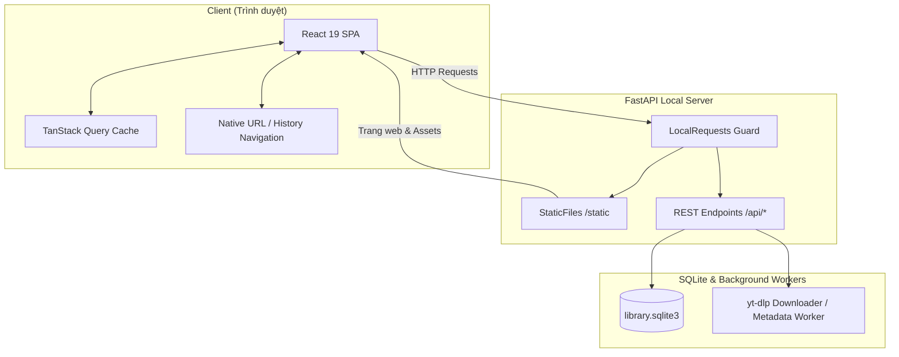

# System Design & Architecture — Frontend Redesign

Cập nhật: **2026-09-20**. Tính năng: `frontend-redesign`.

## Architecture Overview

Ứng dụng Frontend được chuyển đổi thành một **Single Page Application (SPA)** viết bằng React 19 + TypeScript và Vite, nằm trong thư mục `frontend/`. Quá trình build của Vite xuất trực tiếp các static assets vào `src/auralytica/static/`, tương thích tuyệt đối với hạ tầng FastAPI sẵn có.



### Thành phần kỹ thuật
- **Vite + React 19 + TypeScript:** Hiệu năng cao, hot module replacement tức thì trong quá trình phát triển, bundle ra file tĩnh nhỏ gọn.
- **Tailwind CSS v4:** Tạo hiệu ứng kính mờ `backdrop-blur-xl`, bảng màu tối `zinc` chuẩn Apple Pro, viền phản chiếu ánh sáng mảnh `1px`.
- **TanStack Query (React Query):** Quản lý server state, tự động cache, refetch thông minh khi đổi trang/lọc và xử lý optimistic updates khi chuyển bài.

## Component Breakdown

```text
frontend/src/
├── api/
│   ├── client.ts            # Wrapper gọi fetch() kèm kiểm tra lỗi và status
│   └── types.ts             # Định nghĩa Type TypeScript cho toàn bộ Request / Response
├── components/
│   ├── AppShell.tsx         # Header chứa logo text, stepper 4 bước và status
│   ├── Button.tsx           # Nút bấm tối giản theo phong cách Apple Pro
│   ├── Modal.tsx            # Hộp thoại kính mờ cho Metadata / Chọn nguồn
│   └── SongCard.tsx         # Thẻ bài hát 16:9 thumbnail, 1-click select, quick action
├── features/
│   ├── import/
│   │   └── ImportView.tsx   # Khu vực kéo thả folder Takeout và dialog chọn nguồn
│   ├── explore/
│   │   ├── ExploreView.tsx  # Dual-pane container (chia đôi màn hình 50/50)
│   │   ├── ColumnPane.tsx   # Cột duyệt bài (dùng chung cho cả Nhạc và Còn lại)
│   │   └── MetadataSheet.tsx# Modal lấy metadata và xem trước phân loại
│   ├── dedup/
│   │   └── DedupView.tsx    # Danh sách nhóm bài nghi trùng và chọn keep/exclude
│   └── download/
│       └── DownloadView.tsx # Dashboard tải audio, progress bar và batch controls
├── hooks/
│   ├── useWorkflow.ts       # Hook theo dõi trạng thái chung của thư viện
│   └── useDebounce.ts       # Hook trì hoãn tìm kiếm để tối ưu hiệu năng
├── App.tsx                  # Root component điều phối routing dựa vào pathname
└── main.tsx                 # Entrypoint của React
```

## Dual-Pane Explore Design (Trọng tâm)

Màn hình Explore sử dụng component `ColumnPane` cho cả 2 bên:
- **Cột Trái (`group="music"`):** Hiển thị các bài đã được nhận dạng là nhạc.
- **Cột Phải (`group="rest"`):** Hiển thị các bài còn lại/chưa rõ để người dùng duyệt thêm.

### Tương tác Thẻ bài hát (`SongCard`):
1. **1-Click Select:** Bấm vào thẻ để bật/tắt trạng thái chọn trong danh sách `selectedIds: Set<string>`.
2. **Thao tác chuyển hàng loạt:** Nút `Chuyển đã chọn (N)` trên thanh công cụ của cột thực hiện gọi API `POST /api/videos/move`.
3. **Thao tác chuyển 1 chạm:** Hover vào thẻ sẽ hiện nút text `Chuyển →` hoặc `← Thêm`, bấm vào sẽ chuyển ngay bài đó mà không cần chọn trước.
4. **Optimistic UI:** Khi chuyển bài, React Query cập nhật cache ngay lập tức để bài biến mất khỏi cột hiện tại và xuất hiện ở cột đối diện trước khi request HTTP hoàn tất.

## Design Decisions

1. **Không dùng biểu tượng/icon màu mè:**
   - Quyết định: Sử dụng thuần text (`Chuyển`, `Chọn tất cả`, `Lấy metadata`) và ký hiệu mũi tên tối giản (`←`, `→`).
   - Lý do: Mang lại diện mạo nghiêm túc, chuyên nghiệp như các ứng dụng Apple Pro (Logic Pro, Xcode), tránh cảm giác đồ chơi hoặc tủ lạnh dán sticker.
2. **Dual-Pane 50/50 thay vì Vertical Accordion:**
   - Quyết định: Luôn mở cả 2 bảng Nhạc và Còn lại song song trên màn hình rộng.
   - Lý do: Người dùng cần nhìn thấy cả 2 nguồn để so sánh và kéo/thêm bài nhanh nhất có thể.
3. **Modal/Drawer cho Metadata & Classification Preview:**
   - Quyết định: Đưa tính năng chạy metadata vào một Modal kính mờ riêng biệt.
   - Lý do: Không làm mất diện tích của 2 cột duyệt bài; thao tác lấy metadata là tác vụ định kỳ, không cần chiếm màn hình thường trực.

## Non-Functional Requirements

- **Thời gian render:** Dưới 16ms cho mỗi frame khi cuộn danh sách 50–100 bài hát.
- **Dung lượng bundle:** Tổng file JS/CSS đóng gói dưới 250 KB (gzipped).
- **Khả năng phục hồi:** F5 trang giữ nguyên bộ lọc nhờ đồng bộ query parameters trên URL (`?music_search=...&rest_reason=...`).
