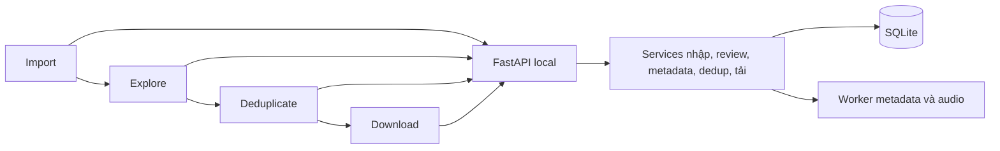

# Web workflow — Design

Cập nhật **2026-09-20**. Review theo [W01–W15 / WA01–WA12](../requirements/2026-09-20-feature-web-workflow.md). Đây là thiết kế cho triển khai, **không mô tả tính năng đã có**. Kết quả review và các giới hạn được ghi cuối tài liệu.

## Architecture Overview

Giữ Python/FastAPI, SQLite, importer, downloader và worker hiện có. Frontend tiếp tục HTML/CSS/JavaScript, chia theo trang; không thêm framework/build pipeline chỉ để làm navigation. FastAPI phục vụ cùng shell tại `/import`, `/explore`, `/deduplicate`, `/download`; frontend chọn module trang theo URL, query string giữ bộ lọc/trang. `/` chuyển về Import khi chưa có dữ liệu, Explore khi đã có.

Không tạo service chỉ để chuyển tiếp từng endpoint: tái dùng nghiệp vụ hiện có; thêm `dedup` cho nhóm/alias/quyết định và một hàm chung xác định tập tải. API và worker gọi cùng logic. CLI nghiệp vụ được loại sau khi web đạt parity, không nhân đôi logic ở hai giao diện.

## Component Breakdown — bốn trang

| Trang | Nội dung chính | Hành động và điều kiện |
| --- | --- | --- |
| Import | Drop/picker folder; chọn history/library; kết quả số dòng/sự kiện/video; lỗi nguồn | Nhập thành công → Explore. Nhập lỗi giữ import cũ. Có batch queued/running thì chặn nhập và dẫn tới Download để dừng. |
| Explore | Nhạc mặc định; thống kê và biểu đồ theo nguồn quyết định; bảng nhạc; mục Còn lại phụ | Lọc/sort/phân trang, mở video, chuyển nhóm; mở panel metadata và preview/apply. “Tiếp tục Deduplicate” dùng toàn bộ nhóm nhạc, không chỉ các dòng hiển thị. |
| Deduplicate | Tóm tắt số bản; nhóm nghi cùng bài; hàng phiên bản với title gốc, kênh, link/ảnh, evidence, duration nếu có | Giữ một/nhiều/tất cả, không ghép nhóm này, hoàn tác, ghép thủ công theo ID. “Tiếp tục” được dùng cả khi chưa duyệt; mặc định mọi bản được giữ. |
| Download | Preview tổng nhạc/loại dedup/giữ/skip/cần tải, đích tải, batch đang chạy và lịch sử | Tải danh sách giữ; stop/resume/retry; lỗi từng video. Link quay về sửa lựa chọn, batch cũ không đổi. |

Thanh điều hướng hiển thị bốn bước và trạng thái dữ liệu, không là wizard bắt hoàn tất. Truy cập trang phụ thuộc khi chưa import hiển thị empty state + nút Import. Không có nhạc thì vẫn xem Download cũ; không tạo batch mới rỗng. Mỗi trang có loading/error/retry; refresh/back không mất quyết định đã lưu.

Bảng video có kích thước mặc định 50, lựa chọn 25/50/100; tổng, trang hiện tại/tổng trang và chuyển trang rõ ràng. Nhóm dedup phân trang riêng theo nhóm (20 nhóm/trang); nhóm lớn phân trang thành viên, nhưng thao tác cả nhóm ghi rõ tổng thành viên. Bộ lọc mới về trang 1; phân trang ổn định có ID làm tie-breaker. Checkbox Explore là chọn tạm để chuyển nhóm; checkbox/toggle “Giữ để tải” ở Deduplicate là quyết định lưu bền và khác nhãn/biểu tượng.

Explore thống kê trên toàn nhóm Nhạc hiện hành; luôn ghi phạm vi nếu áp filter. Phân bố lượt xem và ngày quay lại, kênh, tín hiệu title, mức có/thiếu metadata; tách manual/automatic. Không lấy watch_count làm tổng lượt xem YouTube, không suy ra thời gian nghe từ duration. Số 502 không hardcode. Thống kê này là descriptive, không phải training hoặc accuracy.

## Data Models

Giữ schema v2 hiện có; migration kế tiếp tạo các bảng dưới đây trong một transaction, không đổi ID/lịch sử/download cũ. Tên cột chi tiết được kiểm tra khi viết migration, nhưng ràng buộc nghiệp vụ dưới đây là bắt buộc.

| Thực thể | Nội dung và ràng buộc |
| --- | --- |
| SongAlias | `song_key`, alias gốc/normalized, artist scope nếu biết, nguồn, trạng thái người dùng xác nhận, phiên bản. Một alias có thể thuộc nhiều song_key; không ép unique toàn cục trên title. |
| DedupRun | ID, import ID, input hash, thuật toán/phiên bản alias, trạng thái/counters/thời điểm. Mỗi lượt bất biến về đầu vào. |
| DedupGroup / Member / Evidence | Group gắn run; thành viên video ID, song key/anchor; lưu lý do từng liên kết và marker phiên bản. Group fingerprint dùng tập ID + evidence/algorithm. |
| DownloadSelection | Video ID là khóa, `keep/exclude`, nguồn user, revision và audit. Không có row nghĩa là keep. Chỉ áp selection lên nhạc trong active import; không thay music/rest. |
| RejectedGroup | Fingerprint nhóm bị từ chối, người dùng/thời điểm; cùng nhóm không hiện lặp. Thành viên/evidence thay đổi thành nhóm mới có lý do để duyệt lại. |

Không thêm bảng nhãn nhạc thứ hai. Dùng user_group/auto_group hiện có. Exclude chỉ cho video người dùng đã chọn, không lưu “loại mọi bài cùng tên” áp lên video mới. Một video mới luôn mặc định keep. Các loại bỏ thủ công theo ID được giữ qua reimport; nếu thành viên/metadata thay đổi thì nhóm được đánh dấu cần duyệt lại, không tự đổi lựa chọn.

Audit ghi trước/sau, nguồn quyết định và hash; không ghi log mỗi keystroke tìm kiếm. Xóa alias/group suggestion không xóa Video/WatchEvent/audio. DownloadBatch giữ nguyên các item đã chụp dù lựa chọn hiện tại thay đổi.

## Matching — tiêu đề đa ngôn ngữ

### Pipeline local v1

1. Giữ raw title. Tạo search key bằng Unicode NFKC + casefold, chuẩn hóa khoảng trắng/dấu câu. Chỉ bỏ phụ tố trình bày theo allowlist ở ranh giới (Official Video/Audio, Lyrics…); giữ nghệ sĩ, số/tựa bài và nội dung chưa hiểu. Không bỏ tùy ý mọi chữ trong ngoặc.
2. Trích marker phiên bản (cover/live/remix/slowed/instrumental), title candidate, artist nếu có bằng chứng. Marker không dùng để gộp bản thu; hiển thị cho người dùng so sánh.
3. Sinh ứng viên qua exact normalized title và alias đã xác nhận/có nguồn trong local DB. Ví dụ người dùng chốt `Shoujo A` ↔ `少女A` được lưu như alias có provenance, không hardcode trong thuật toán. Fixture dùng alias tường minh; không tuyên bố regex tự dịch tiếng Nhật.
4. Khi hai video cùng alias/song key có bằng chứng, đưa vào cùng nhóm **nghi cùng bài**. Với tên giống nhưng chưa biết artist vẫn có thể gợi ý, nhưng ghi thiếu bằng chứng; artist khác/xung đột không tự ghép vào nhóm chắc chắn. Mọi nhóm đều không tự loại bản.
5. Bản đầu không dùng fuzzy/embedding làm điều kiện ghép tự động hoặc dịch vụ dịch ngoài. Tìm kiếm + chọn ghép thủ công hỗ trợ ca chưa có alias; người dùng có thể xác nhận alias để lần sau tái sử dụng. Đây là giới hạn coverage được thể hiện, không phải “không có trùng”.

Không dùng connected components đơn thuần để nối A≈B, B≈C thành A≈C. Nhóm theo song key hoặc anchor/title key có evidence cho từng thành viên; xung đột được tách và có thể chọn thủ công. Nếu một video thuộc nhiều giả thuyết nhóm, quyết định keep/exclude vẫn chỉ có một giá trị theo video ID.

### Quyết định kỹ thuật và phương án loại

- **Chọn chuẩn hóa + alias local có nguồn + người dùng xác nhận:** giải thích được, không thêm API trả phí, phù hợp matching theo title đã yêu cầu.
- Fuzzy/phiên âm tự động: để sau baseline; tên romanized có thể mơ hồ, cần bộ nhãn và kiểm chứng trước khi dùng để xếp nhóm.
- Dịch/LLM/embedding ngoài: chưa thuộc thiết kế được phép triển khai. Nếu baseline thiếu coverage, đề xuất riêng cùng dữ liệu gửi đi/chi phí; không âm thầm bổ sung.

Không đưa confidence giả thành phần trăm. UI dùng lý do “Tên chuẩn hóa giống nhau”, “Alias đã xác nhận”, “Thiếu nghệ sĩ / cần xem lại”. Sắp xếp ổn định theo loại evidence, số thành viên, group ID; không gọi đây là xác suất.

## API Design

JSON API trên loopback, giữ kiểm tra Host/Origin và input bounds hiện tại. Trả lỗi có mã/message; stale snapshot hoặc batch lock trả 409. Page size bounded, stable sort. Các endpoint mới dưới đây là contract thiết kế, **chưa triển khai**.

| API | Hành vi |
| --- | --- |
| GET `/api/workflow` | Active import, totals, batch lock, các bước khả dụng và revision dữ liệu. Không sửa trạng thái. |
| POST `/api/imports`; GET `/api/videos`; POST `/api/videos/move` | Tái dùng hợp đồng hiện tại; thêm revision cho client nhận biết dữ liệu đổi. |
| GET `/api/explore/summary` | Thống kê có phạm vi và nguồn nhãn, từ active import và group/filter rõ ràng. |
| POST/GET `/api/metadata/runs`; GET `/api/metadata/runs/{id}`; POST `/{id}/stop`, `/{id}/resume` | Snapshot ID chọn trong active import, preview phạm vi trước start, progress/errors và resume cùng snapshot. Không tải audio. |
| POST `/api/classification/previews`; GET `/{id}`; POST `/{id}/apply` | Preview lưu server-side từ evidence hiện có; UI không upload đường dẫn CSV hoặc JSON giả làm quyết định. Apply recompute/so revision dưới write lock như service hiện tại. |
| POST/GET `/api/dedup/runs`; GET `/api/dedup/runs/{id}` | Bắt đầu/đọc job trên nhạc hiện hành, trả 202 khi tạo job. Dùng input hash để tái sử dụng kết quả không đổi. |
| GET `/api/dedup/groups?run_id=...&page=...` | Nhóm, số thành viên/tổng giữ, evidence, stale flag; member pagination riêng nếu cần. |
| PATCH `/api/download-selection` | Body `expected_revision`, các video ID và keep/exclude; validate toàn bộ rồi atomic update + audit. Không nhận “ID trên trang này” làm toàn bộ nhóm. |
| POST `/api/dedup/groups/{id}/reject`; POST `/api/dedup/manual-groups` | Từ chối fingerprint, hoặc nhóm ID user chọn; xác nhận alias là thao tác tường minh, không suy ra từ việc loại một bản. |
| POST `/api/song-aliases`; DELETE `/api/song-aliases/{id}` | Tạo/thu hồi alias local có scope/provenance; tăng alias revision và đánh dấu run liên quan cũ. |
| GET `/api/downloads/preview`; POST `/api/downloads` và status/stop/resume | Tái dùng, bổ sung selection revision/hash và counts dedup; start yêu cầu preview token còn khớp. |

Routes `/{id}/...` trong bảng metadata/classification là phần nối với base tương ứng. Mutation đồng thời từ hai tab dùng expected_revision để từ chối mất cập nhật. UI refresh state sau 409, không tự retry một lựa chọn trên snapshot khác.

## Tập tải và transaction

Hàm domain dùng chung cho preview và create_batch:

`eligible = active_history_ids ∩ effective_music_ids − explicitly_excluded_ids`

`music_total = excluded_by_dedup + kept_total`; `kept_total = valid_existing_files + queued_to_download` tại thời điểm preview. File validity vẫn theo thư mục đích/kích thước quy tắc hiện có, kiểm tra lại lúc start. Không tính video không tải được thành “skip file đã có”.

Create batch dùng BEGIN IMMEDIATE, kiểm tra preview revision/hash + output path, lấy toàn bộ eligible, kiểm tra file rồi lưu item snapshot. Batch cũ queued/running được trả về như hiện tại nhưng UI phải ghi đó là batch đã có; không giả vờ áp selection mới. Các mutation import/move/selection/apply bị chặn khi batch queued/running. Được đọc/duyệt; muốn sửa phải dừng batch. Resume dùng item cũ; “tải danh sách mới” tạo batch khác khi không còn batch đang chạy.

## Jobs, metadata và reimport

Metadata worker giữ provider/version/exact ID, retry/cache/lock; HTTP handler chỉ tạo job và trả ID. Dedup worker đọc immutable input, ghi kết quả theo run; nếu input đổi khi job chạy thì đánh dấu kết quả stale, không sửa selection. Sau restart, job bỏ dở chuyển paused/interrupted, có nút chạy lại/tiếp tục phù hợp. UI polling theo trạng thái, dừng khi job kết thúc hoặc trang bị ẩn.

Metadata type/category thuộc video; recurrence thuộc active import. Cache key tiếp tục theo video/provider/parser/language/location và TTL hiện có, hiển thị observation age. Chỉ evidence hợp lệ đúng ID được dùng; hết hạn hiển thị stale và gợi ý refresh, không tự biến video thành non_music. Cần tách “thiếu bằng chứng mới” khỏi “nhãn người dùng đã chọn”. History hash vẫn chặn apply preview cũ, không dùng để vô hiệu hóa metadata cùng ID chưa hết hạn. Regression phải bao phủ hai video đã bị trả về Còn lại ở lần import trước.

Mỗi import làm mới số lượt/ngày xem và input revision. Không cộng chồng các export. Manual labels, selection theo ID, alias và kết quả tải được giữ. Các ID ngoài active import không nằm trong eligible hoặc thống kê thư viện hiện hành.

## Security & Performance

Không hosted auth mới. Giữ loopback/Host/Origin, giới hạn upload; chỉ nhận Takeout và metadata qua adapter hiện có. Alias/title render text, không HTML. Không tự fetch arbitrary URL từ title/alias. Metadata network có scope xác nhận trên web; không tự quét cả lịch sử.

Phân trang tại service/API, tổng riêng khỏi page. Nhóm theo blocking keys tránh so mọi cặp 7.500 video; phiên bản đầu dùng normalized key/alias lookup, không all-pairs embeddings. Đo thực tế import/list/stats/dedup trên fixture ≥7.500 video; chưa hứa con số latency trước benchmark. Cần index video ID, active import, normalized alias và selection.

## Rollout và bỏ CLI

1. Backup và migration transaction; kiểm tra giữ mọi sửa tay/history/audio references. Chỉ bổ sung bảng/cột cần thiết.
2. Navigation + Import/Explore trước, sau đó metadata và dedup/selection; tạo Download theo eligible dùng chung.
3. Kiểm thử browser parity cho tất cả nghiệp vụ trước khi gỡ các subcommand user-facing khỏi launcher/docs. Giữ worker/service nội bộ; không xóa backend đang được web sử dụng.
4. Linux local launcher không đối số mở server loopback và trình duyệt; thêm launcher desktop để người dùng mở web không cần lệnh nghiệp vụ. Cài môi trường lần đầu được tài liệu hóa riêng, chưa cam kết installer đa nền tảng. Không kill process chiếm cổng; báo lỗi/hướng dẫn nếu không xác minh được instance hiện có.
5. Rollback phải giữ backup và file audio; schema tương lai không được mở bằng code cũ rồi tự hạ version.

## Review coverage và bước tiếp theo

| Yêu cầu | Thiết kế tương ứng |
| --- | --- |
| W01–W03 | Routes, điều hướng/empty state, importer hiện có, rollout bỏ CLI |
| W04–W05 | Explore nhóm Nhạc, summary theo scope/provenance và pagination |
| W06–W07 | Job API, preview server-side, transaction/revision và metadata độc lập import |
| W08–W10 | Pipeline local/alias, evidence từng liên kết, nhóm và lựa chọn nhiều bản |
| W11–W12 | DownloadSelection riêng khỏi nhãn, default keep và eligible dùng chung |
| W13–W14 | Worker/snapshot cũ, invalidation và reimport/giữ quyết định |
| W15 | Page/query state, stable sort, phân biệt bulk move với selection bền |

Đã khép các quyết định thiết kế chính cho baseline local. Giới hạn đã nêu: alias chưa biết cần người dùng cung cấp bằng chứng, không tự dịch/phiên âm mọi tên; chưa đo chất lượng matching trên dữ liệu thật. Kịch bản test cần cả alias đúng/sai, tên đồng âm, cùng bài khác bản và thao tác nhiều tab.

Bước kế tiếp: cập nhật task triển khai chi tiết và chuẩn bị workspace chứa đủ thay đổi chưa commit. Chưa triển khai schema/API/page mới trong phase này. Lint docs đầy đủ; branch `feature-web-workflow` vẫn chưa tồn tại. Không đánh dấu feature hoàn tất hoặc dùng test MVP để nghiệm thu thiết kế này.
