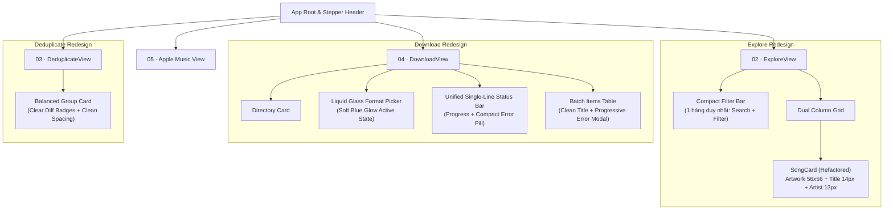

# System Design — FE Declutter & Aesthetic Overhaul

Ngày cập nhật: **2026-09-22**. Tính năng: `fe-declutter-and-aesthetic-overhaul`.

---

## 1. Architecture & Component Hierarchy Overview

---

## 2. Design System Tokens (Thang đo Thiết kế Chuẩn hóa)

### 2.1. Typography Scale (Thang chữ tối thiểu 12px)
| Cấp bậc (Level) | Tailwind Class | Kích thước | Mục đích sử dụng |
| :--- | :--- | :--- | :--- |
| **Page Title** | `text-xl font-bold` | 20px | Tiêu đề bước (`02 · Explore`, `04 · Download`) |
| **Section Header** | `text-sm font-semibold tracking-wide uppercase` | 14px | Tiêu đề cột (`Nhạc đã nhận diện`, `Lượt tải`) |
| **Primary Content** | `text-sm font-medium` | 14px | Tên bài hát, Tiêu đề card, Tên file chính |
| **Secondary Meta** | `text-xs font-normal` | 12px | Tên ca sĩ, Lượt nghe, Thông tin định dạng phụ |
| **Status Badge** | `text-xs font-mono font-medium` | 12px | Badge trạng thái (`Hoàn tất`, `Có bài lỗi`) |
| *Cấm tuyệt đối* | `text-[9px]`, `text-[10px]`, `text-[11px]` | < 12px | **Bị loại bỏ hoàn toàn** khỏi codebase |

### 2.2. Surface & Material Tokens (Liquid Glass Theme)
- **Base Canvas**: Nền đen sâu `#09090b` với điểm xuyết hiệu ứng tản sáng mờ vi tế.
- **Glass Panel**: `bg-zinc-900/40 backdrop-blur-xl border border-white/8 rounded-2xl`.
- **Card Hover / Resting**: `bg-zinc-950/30 hover:bg-zinc-800/30 border border-white/5 rounded-xl transition-all duration-150`.
- **Active State (Apple Accent)**: Thay thế hoàn toàn nền trắng xóa (`bg-zinc-100`) bằng:
  `bg-sky-500/15 border-sky-400/50 text-sky-100 shadow-[0_0_15px_rgba(56,189,248,0.15)]`.

---

## 3. Component Breakdown & Refactoring

### 3.1. `SongCard.tsx` (Dọn sạch 60% rác thị giác)
- **Trước**:
  - Thumbnail 48x48px co kéo.
  - 5 dòng: Tên bài -> Kênh -> `51 lượt · Kênh Topic` -> `Trạng thái tải: completed`.
  - Nút bấm `Chuyển →` chiếm diện tích lớn.
- **Sau (Refactored)**:
  - Thumbnail vuông chuẩn `w-14 h-14` (56x56px), bo góc `rounded-xl`, `object-cover`, bóng đổ nhẹ `shadow-sm`.
  - Dòng 1: Tên bài hát (`text-sm font-medium text-zinc-100 truncate`).
  - Dòng 2: Tên ca sĩ / Kênh (`text-xs text-zinc-400 truncate`).
  - Dòng 3 (Phụ trợ): Lượt nghe (`text-xs text-zinc-500 font-mono`).
  - *Xóa bỏ*: `Trạng thái tải: completed`, các tag lý do phân loại nội bộ (`Flabs`, `Topic`, `auto_group`).

### 3.2. `ColumnPane.tsx` (Thu gọn bộ lọc)
- Gom 2 hàng tìm kiếm & dropdown thành **1 hàng duy nhất**:
  `[ Ô tìm kiếm tiêu đề/kênh (flex-1) ] [ Lọc lý do (w-auto) ] [ Sắp xếp (w-auto) ]`.
- Giảm chiều cao thanh điều khiển từ 120px xuống 48px, giải phóng thêm 3-4 card hiển thị trong viewport.

### 3.3. `DownloadView.tsx` (Xóa bỏ hội chứng buồng lái máy bay)
- **Format Cards**:
  - Thu gọn kích thước, chỉ hiển thị Tên định dạng (13px font-semibold) + Badge ngắn gọn (11-12px).
  - Trạng thái Active dùng kính ánh xanh `border-sky-400/40 bg-sky-500/10 text-white`, êm dịu trong phòng tối.
- **Banner Báo cáo & Lỗi**:
  - Gộp cả 3 banner (Batch info, Apple Music callout, Error box) thành **1 Status Bar duy nhất**:
    `● Hoàn tất 520 / 523 bài (99.4%)` kèm nút bấm hành động duy nhất `[ Thử lại 3 bài lỗi ]`.
  - Nếu batch tải đã chọn làm sạch tên và M4A, ẩn banner gợi ý bước 05 để tránh gây hoang mang.

### 3.4. `DeduplicateView.tsx` (Cân bằng không gian)
- Bỏ dòng mô tả thuật toán regex dài ngoằng.
- Đưa các bản thu về bố cục so sánh trực diện (Side-by-side or clean list) với badge `Khuyên giữ` / `Loại bỏ` rõ ràng.

---

## 4. Design Decisions & Trade-offs

1. **Trade-off: Ẩn thông tin debug vs Minh bạch kỹ thuật**:
   - *Quyết định*: Ẩn các mã `error_code`, `flabs`, `subtitles: Topic` khỏi view mặc định.
   - *Lý do*: 99% thời gian người dùng chỉ cần biết tên bài và ca sĩ. Người dùng muốn xem chi tiết kỹ thuật có thể bấm vào nút "Chi tiết" để mở modal chuyên biệt.
2. **Trade-off: Tương phản gắt (White-on-Black) vs Kính ánh xanh (Apple Tint)**:
   - *Quyết định*: Bỏ trạng thái active màu trắng tinh.
   - *Lý do*: Màu trắng solid trên nền OLED/Dark Mode gây chói lóa (Glare), làm mỏi mắt và phá vỡ tính thẩm mỹ của giao diện kính Liquid Glass.

---

## 5. Non-Functional Requirements
- **Hiệu năng Render**: DOM tree nhẹ hơn 40%, không có layout shift khi scroll.
- **Khả năng tiếp cận (Accessibility)**: Tương phản chữ text-zinc-100 và text-zinc-400 trên nền dark đạt chuẩn WCAG AA (> 4.5:1).
