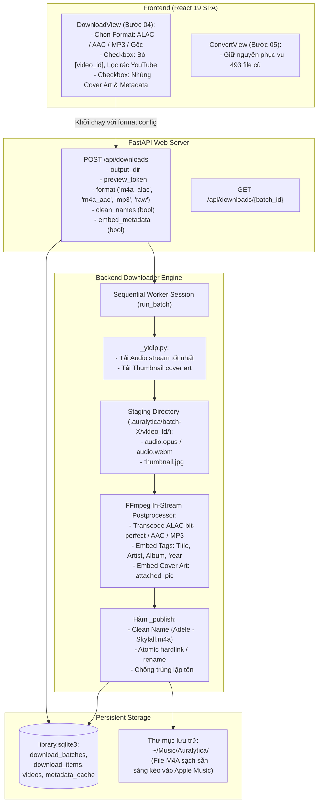

# System Design & Architecture — In-Stream Audio Pipeline & Metadata Embedding

Cập nhật: **2026-09-22**. Tính năng: `local-app-and-audio-pipeline`.

---

## 1. Architecture Overview

Hệ thống nâng cấp luồng xử lý tải nhạc tuần tự (Sequential Audio Downloader) từ mô hình tải thô (raw WebM) sang mô hình **In-Stream Processing Pipeline**: Tải audio stream và thumbnail ảnh bìa song song, tự động làm sạch tên file, chuyển đổi sang định dạng Apple Music (M4A ALAC Lossless / AAC) hoặc MP3, nhúng toàn bộ metadata và ảnh bìa trước khi xuất bản file vào thư mục đích.



---

## 2. Component Breakdown

### 2.1. In-Stream Downloader Post-processor ([`src/auralytica/downloader.py`](file:///home/sakana/Code/Auralytica/src/auralytica/downloader.py))
- **Nhiệm vụ:**
  - Nhận cấu hình từ batch: `format` (`m4a_alac`, `m4a_aac`, `mp3`, `raw`), `clean_names`, `embed_metadata`.
  - Điều phối `_ytdlp.py` tải audio stream và thumbnail ảnh bìa về thư mục staging `.auralytica/batch-{batch_id}/{video_id}/`.
  - Gọi FFmpeg xử lý ngay tại staging directory:
    - Nếu format là `m4a_alac`: `-c:a alac -vn -map 0:a -map 1:v? -c:v copy -disposition:v:0 attached_pic`.
    - Nếu format là `m4a_aac`: `-c:a aac -b:a 256k -vn -map 0:a -map 1:v? -c:v copy -disposition:v:0 attached_pic`.
    - Nếu format là `mp3`: `-c:a libmp3lame -b:a 320k -vn -map 0:a -map 1:v? -c:v copy -id3v2_version 3`.
    - Nếu format là `raw`: Giữ nguyên file audio stream tải về.
  - Lấy metadata từ `videos`, `metadata_cache` hoặc heuristic parser:
    - `Title`: Tên bài hát đã làm sạch.
    - `Artist`: Tên ca sĩ (đã lọc bỏ ` - Topic`).
    - `Album`: Tên album nếu có (hoặc fallback tên ca sĩ / playlist).
  - Xuất bản file hoàn tất với đuôi tương ứng (`.m4a` hoặc `.mp3` hoặc `.webm`).

### 2.2. Isolated Child Downloader ([`src/auralytica/_ytdlp.py`](file:///home/sakana/Code/Auralytica/src/auralytica/_ytdlp.py))
- **Nhiệm vụ:**
  - Thêm cờ `'writethumbnail': True` vào options của `YoutubeDL`.
  - Chuyển đổi thumbnail sang định dạng ảnh JPG tương thích (`FFmpegThumbnailsConvertor` với `format: 'jpg'`).
  - Trả về đường dẫn `thumbnail_path` trong JSON emit result:
    ```json
    {
      "type": "result",
      "id": "...",
      "path": "...",
      "thumbnail_path": "...",
      "acodec": "...",
      "vcodec": "none"
    }
    ```

### 2.3. Clean Name & Collision Resolver ([`src/auralytica/converter.py`](file:///home/sakana/Code/Auralytica/src/auralytica/converter.py))
- Tận dụng hàm `clean_title(raw_name)` và `parse_artist_title(cleaned_stem)` đã xây dựng:
  - Loại bỏ hoàn toàn mã `[video_id]`.
  - Loại bỏ các từ thừa của YouTube: `Official Music Video`, `Lyric Video`, `MV`, `Audio`, `HQ`, `HD`...
  - Chuẩn hóa khoảng trắng và gạch nối.
  - Định dạng chuẩn: `Artist - Title.m4a` (nếu có Artist) hoặc `Title.m4a`.
- Cơ chế chống trùng lặp tên trong `_publish`:
  - Nếu file đã tồn tại trên đĩa (ví dụ hai bài cùng tên nhưng khác video_id): tự động thêm số thứ tự `Artist - Title (1).m4a`, `Artist - Title (2).m4a`.

### 2.4. Giao diện Download ([`frontend/src/features/download/DownloadView.tsx`](file:///home/sakana/Code/Auralytica/frontend/src/features/download/DownloadView.tsx))
- Bổ sung khối **Cấu hình định dạng tải (Format & Metadata Options)**:
  - Bộ 3 thẻ chọn định dạng:
    - `M4A · Apple Lossless (ALAC)` *(Mặc định khuyên dùng — bit-perfect cho Apple Music)*.
    - `M4A · AAC (256 kbps)` *(Chuẩn iTunes Store gọn nhẹ)*.
    - `MP3 (320 kbps)` *(Phổ quát)*.
    - `WebM (Nguyên bản)` *(Không chuyển đổi)*.
  - Tùy chọn làm sạch tên: Checkbox `[x] Loại bỏ mã [video_id] và từ rác YouTube`.
  - Tùy chọn siêu dữ liệu: Checkbox `[x] Tự động nhúng Cover Art và thẻ bài hát`.
- Khi người dùng bấm `[ Tải toàn bộ bản giữ ]`: Gửi payload cấu hình xuống backend để worker thực thi.

---

## 3. Data Models & API Specifications

### 3.1. API Request Models ([`src/auralytica/web.py`](file:///home/sakana/Code/Auralytica/src/auralytica/web.py))
```python
class DownloadRequest(BaseModel):
    model_config = ConfigDict(extra='forbid')
    output_dir: str = Field(min_length=1, max_length=4096)
    preview_token: str = Field(min_length=64, max_length=64, pattern=r'^[0-9a-f]{64}$')
    format: Literal['m4a_alac', 'm4a_aac', 'mp3', 'raw'] = 'm4a_alac'
    clean_names: bool = True
    embed_metadata: bool = True
```

### 3.2. Batch Settings Persistence ([`src/auralytica/batches.py`](file:///home/sakana/Code/Auralytica/src/auralytica/batches.py))
- Lưu các tham số cấu hình của batch vào `download_batches` hoặc bảng `settings`:
  - `batch_format:{batch_id}` -> `'m4a_alac'`
  - `batch_clean_names:{batch_id}` -> `'1'`
  - `batch_embed_metadata:{batch_id}` -> `'1'`

---

## 4. Design Decisions & Trade-offs

1. **In-Stream Processing vs Post-Download Batch:**
   - *Quyết định:* Thực hiện chuyển đổi và nhúng metadata ngay trong quá trình tải tuần tự từng bài (In-Stream) tại thư mục staging.
   - *Lý do:* Tốc độ mã hóa ALAC / AAC của FFmpeg trên máy đạt hơn 250x (mất chưa đầy 1 giây cho bài 4 phút). Làm từng bài ngay khi tải xong giúp file xuất hiện ngay lập tức trong thư mục nhạc với định dạng M4A hoàn chỉnh, không cần chờ toàn bộ 500 bài tải xong mới convert tập trung.
2. **Loại bỏ hoàn toàn `[video_id]` trong tên file:**
   - *Quyết định:* Tên file mặc định là `Artist - Title.m4a` (hoặc `Title.m4a`), loại bỏ hoàn toàn `[video_id]`.
   - *Xử lý đụng độ (Collision):* Hàm `_publish` đã có vòng lặp kiểm tra `target.exists()`. Nếu phát hiện trùng tên, tự động tăng số ` (1)`, ` (2)` mà không cần mã hash rác.
3. **Giữ nguyên trang Apple Music (Bước 05):**
   - *Quyết định:* Tiếp tục duy trì `ConvertView.tsx` trong menu điều hướng để xử lý 493 file `.webm` đã tải ở các phiên trước, chỉ gỡ bỏ khi người dùng yêu cầu.

---

## 5. Security & Performance

- **An toàn tệp tin:** Sử dụng cơ chế ghi staging tạm thời (`.auralytica/batch-X/video_id/`), chỉ sau khi FFmpeg tạo file hoàn tất và hợp lệ mới link/rename vào thư mục xuất bản.
- **Không suy hao âm thanh:** Định dạng ALAC giải mã từ Opus nguồn sang PCM rồi nén lossless bằng thuật toán của Apple, giữ bit-perfect chất lượng âm thanh gốc.
- **Bảo mật lệnh FFmpeg:** Toàn bộ tham số và đường dẫn được truyền dưới dạng mảng `subprocess.run([...])`, loại bỏ hoàn toàn nguy cơ shell injection.
