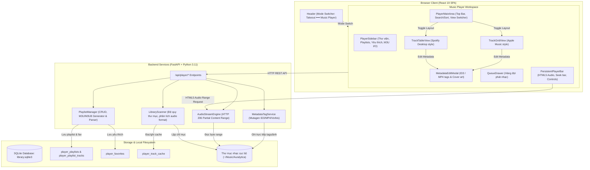

# System Design & Architecture — Local Media Player

Ngày tạo: **2026-09-24**. Tính năng: `local-media-player`. Nhánh: `feature-local-media-player`.

---

## 1. Architecture Overview

### 1.1. Sơ đồ Kiến trúc Tổng thể (High-level System Architecture)



### 1.2. Technology Stack & Rationale

| Lớp (Layer) | Công nghệ | Lý do lựa chọn |
| :--- | :--- | :--- |
| **Frontend Framework** | React 19 + TypeScript + Vite | Tương thích hoàn toàn với nền tảng hiện có, SPA mượt mà, phản hồi tức thì. |
| **CSS & Design System** | Tailwind CSS v4 + Liquid Glass Theme | Thống nhất với ngôn ngữ thiết kế dark mode mờ ảo hiện đại của Auralytica. |
| **Audio Playback** | HTML5 Audio API + Web Audio hooks | Tiêu chuẩn web gốc, hỗ trợ buffer streaming, seek, volume và event listeners chuẩn. |
| **State Persistence** | Browser `localStorage` | Lưu toàn diện trạng thái Player (bài phát, vị trí seek, âm lượng, queue, shuffle/repeat) để phục hồi ngay khi reload. |
| **Backend Framework** | FastAPI + Starlette StreamingResponse | Hỗ trợ HTTP 206 Partial Content (Byte Range requests) cho phép tua seek nhạc tức thì (< 50ms). |
| **Audio Tagging** | `mutagen` (Python) | Thư viện tiêu chuẩn công nghiệp mạnh mẽ nhất xử lý ID3 (MP3), MP4/iTunes tags (M4A/ALAC), Vorbis (FLAC/Opus) và ảnh bìa nhúng. |
| **Database** | SQLite3 (`library.sqlite3`) | Lưu trữ cục bộ không cần server riêng, đảm bảo 100% dữ liệu offline và an toàn. |

---

## 2. Data Models (Cơ sở Dữ liệu & Schemas)

### 2.1. SQLite Tables

```sql
-- 1. Bảng danh sách phát do người dùng tạo
CREATE TABLE IF NOT EXISTS player_playlists (
    id INTEGER PRIMARY KEY AUTOINCREMENT,
    name TEXT NOT NULL,
    description TEXT DEFAULT '',
    created_at TEXT NOT NULL,
    updated_at TEXT NOT NULL
);

-- 2. Bảng các bài hát trong playlist
CREATE TABLE IF NOT EXISTS player_playlist_tracks (
    playlist_id INTEGER NOT NULL REFERENCES player_playlists(id) ON DELETE CASCADE,
    track_path TEXT NOT NULL,
    position INTEGER NOT NULL DEFAULT 0,
    added_at TEXT NOT NULL,
    PRIMARY KEY(playlist_id, track_path)
);

-- 3. Bảng bài hát yêu thích (1-click Heart Favorite)
CREATE TABLE IF NOT EXISTS player_favorites (
    track_path TEXT PRIMARY KEY,
    added_at TEXT NOT NULL
);

-- 4. Bảng cache chỉ mục thư viện (giúp duyệt nhanh hàng nghìn bài không phải đọc lại tag từng file)
CREATE TABLE IF NOT EXISTS player_track_cache (
    track_path TEXT PRIMARY KEY,
    file_name TEXT NOT NULL,
    title TEXT,
    artist TEXT,
    album TEXT,
    genre TEXT,
    year TEXT,
    duration REAL DEFAULT 0,
    file_size INTEGER NOT NULL,
    mtime_ns INTEGER NOT NULL,
    has_art INTEGER DEFAULT 0,
    updated_at TEXT NOT NULL
);

CREATE INDEX IF NOT EXISTS idx_playlist_tracks_pos ON player_playlist_tracks(playlist_id, position);
CREATE INDEX IF NOT EXISTS idx_track_cache_artist ON player_track_cache(artist);
CREATE INDEX IF NOT EXISTS idx_track_cache_album ON player_track_cache(album);
```

### 2.2. TypeScript Data Structures

```typescript
export interface PlayerTrack {
  path: string;
  filename: string;
  title: string;
  artist: string;
  album: string;
  genre: string;
  year: string;
  duration: number; // in seconds
  file_size: number;
  has_cover_art: boolean;
  is_favorite: boolean;
  mtime_ns: number;
}

export interface PlayerPlaylist {
  id: number;
  name: string;
  description: string;
  track_count: number;
  created_at: string;
  updated_at: string;
}

export interface PlayerState {
  currentTrack: PlayerTrack | null;
  isPlaying: boolean;
  currentTime: number;
  duration: number;
  volume: number;
  isMuted: boolean;
  isShuffle: boolean;
  repeatMode: 'off' | 'all' | 'one';
  queue: PlayerTrack[];
  queueIndex: number;
}
```

---

## 3. API Design

Tất cả các API được bảo vệ bởi bộ kiểm tra phạm vi thư mục (`Path Boundary Validation`), ngăn ngừa truy cập file nhạy cảm ngoài thư mục nhạc.

### 3.1. Thư viện & Duyệt bài (Library Endpoints)
- **`GET /api/player/library`**
  - Query params: `folder` (optional, default to setting `output_dir`), `refresh` (boolean).
  - Trả về danh sách bài hát cùng metadata đã lập chỉ mục và trạng thái yêu thích.
- **`POST /api/player/scan`**
  - Body: `{ folder?: string }`.
  - Quét đệ quy thư mục, cập nhật `player_track_cache` dựa trên `mtime_ns` và trả về kết quả quét.
- **`GET /api/player/stream`**
  - Query params: `path` (đường dẫn tương đối hoặc tuyệt đối an toàn).
  - Headers: `Range: bytes=start-end`.
  - Phản hồi: `206 Partial Content` (kèm `Content-Range`, `Accept-Ranges: bytes`, `Content-Type: audio/*`).
- **`GET /api/player/art`**
  - Query params: `path`.
  - Phản hồi: Binary image data (`image/jpeg` hoặc `image/png`) trích xuất từ tag nhúng của file audio, cache header `Cache-Control: public, max-age=86400`.

### 3.2. Chỉnh sửa Metadata (Metadata Editing)
- **`POST /api/player/metadata`**
  - Content-Type: `multipart/form-data`.
  - Fields: `path`, `title`, `artist`, `album`, `genre`, `year`, `rename_file` (boolean, optional), `cover_art` (file binary, optional).
  - Xử lý: Sử dụng `mutagen` ghi nguyên tử (atomic write) vào file; cập nhật cache CSDL; trả về metadata mới và đường dẫn file mới nếu có đổi tên.

### 3.3. Quản lý Playlists & Yêu thích (Playlists Endpoints)
- **`GET /api/player/playlists`**: Danh sách tất cả playlist kèm số lượng bài.
- **`POST /api/player/playlists`**: Tạo playlist mới `{ name, description }`.
- **`PUT /api/player/playlists/{id}`**: Đổi tên hoặc mô tả playlist.
- **`DELETE /api/player/playlists/{id}`**: Xóa playlist.
- **`GET /api/player/playlists/{id}/tracks`**: Danh sách bài hát trong playlist.
- **`POST /api/player/playlists/{id}/tracks`**: Thêm bài vào playlist `{ track_paths: string[] }`.
- **`DELETE /api/player/playlists/{id}/tracks`**: Xóa bài khỏi playlist `{ track_path: string }`.
- **`PUT /api/player/playlists/{id}/reorder`**: Sắp xếp lại thứ tự bài `{ ordered_paths: string[] }`.
- **`POST /api/player/favorites/toggle`**: Đảo trạng thái yêu thích `{ track_path: string }`.
- **`GET /api/player/favorites`**: Lấy danh sách bài hát yêu thích.
- **`GET /api/player/playlists/{id}/export-m3u`**: Tải xuống file playlist định dạng `.m3u8` chuẩn UTF-8.
- **`POST /api/player/playlists/import-m3u`**: Upload file `.m3u` / `.m3u8` để tạo playlist tương ứng.

---

## 4. Component Breakdown (Frontend React Components)

```text
frontend/src/
├── features/
│   └── player/
│       ├── PlayerRootView.tsx       # Root container, quản lý active view & context
│       ├── PlayerSidebar.tsx        # Cột trái: Tất cả bài hát, Yêu thích, danh sách Playlist, M3U I/O
│       ├── PlayerHeader.tsx         # Thanh đầu trang: Thư mục nguồn, Search, Sắp xếp, View Switcher
│       ├── TrackTableView.tsx       # Bố cục Table kiểu Spotify Desktop
│       ├── TrackGridView.tsx        # Bố cục Grid thẻ đĩa nhạc kiểu Apple Music
│       ├── PersistentPlayerBar.tsx  # Thanh điều khiển phát nhạc cố định chân trang
│       ├── QueueDrawer.tsx          # Drawer danh sách chờ phát (Upcoming Queue)
│       ├── MetadataEditModal.tsx    # Modal chỉnh sửa tag ID3/MP4 & thay đổi ảnh bìa
│       └── PlaylistModal.tsx        # Modal tạo / đổi tên Playlist
├── context/
│   └── AudioPlayerContext.tsx       # Global Audio Context: audio element, queue, time, persistence
```

### 4.1. AudioPlayerContext
- Quản lý 1 đối tượng `HTMLAudioElement` duy nhất, không bị unmount khi chuyển đổi giao diện hoặc đổi mode `Takeout ⟷ Music Player`.
- Lắng nghe các sự kiện: `timeupdate`, `ended`, `loadedmetadata`, `error`, `play`, `pause`.
- Tự động chuyển bài kế tiếp khi hết bài (auto-next) tôn trọng chế độ Shuffle và Repeat.
- Đồng bộ `localStorage` mỗi khi chuyển bài, tua seek hoặc đổi volume.

---

## 5. Design Decisions & Trade-Offs

1. **Phát nhạc qua Backend Stream vs Đọc trực tiếp từ file:/// URL của trình duyệt:**
   - *Quyết định:* Stream qua FastAPI endpoint (`/api/player/stream`).
   - *Lý do:* Trình duyệt hiện đại chặn truy cập giao thức `file://` từ web app vì lý do bảo mật. Stream qua FastAPI còn cho phép hỗ trợ chuẩn HTTP 206 Partial Content để tua nhạc cực nhanh và bảo vệ hệ thống tệp với path validation.
2. **Lập chỉ mục bằng CSDL Cache (`player_track_cache`):**
   - *Quyết định:* Lưu metadata đã đọc vào SQLite, so khớp bằng `mtime_ns` và `file_size`.
   - *Lý do:* Đọc thẻ tag ID3/MP4 từ hàng trăm file đĩa mỗi lần mở ứng dụng sẽ gây nghẽn I/O ổ đĩa. Có cache giúp ứng dụng mở lên tải ngay 500 bài trong vòng < 20ms.
3. **Ghi Tag trực tiếp vào file bằng Mutagen:**
   - *Quyết định:* Ghi trực tiếp vào file vật lý, giữ nguyên tên file mặc định trừ khi người dùng bật checkbox "Đổi tên file theo chuẩn".
   - *Lý do:* Giúp file nhạc tương thích tốt với mọi phần mềm nghe nhạc bên ngoài (Apple Music, iTunes, Car audio...), đồng thời an toàn không làm gãy đường dẫn của các chương trình khác.

---

## 6. Non-Functional Requirements (NFR)

- **Hiệu năng phát nhạc:** Khởi động phát audio trong vòng **< 100ms**; độ trễ khi kéo thanh trượt seek **< 50ms**.
- **Hiệu năng giao diện:** Chuyển đổi giữa Table View và Grid View diễn ra tức thì (**< 16ms / 60 FPS**).
- **Tính toàn vẹn dữ liệu:** Quá trình ghi tag sử dụng atomic write; nếu có lỗi trong quá trình upload ảnh hoặc ghi tag, file gốc được bảo toàn nguyên vẹn.
- **Bảo mật:** Chặn path traversal (`..` hoặc file ngoài thư mục được chỉ định); chỉ chấp nhận các đuôi mở rộng audio hợp lệ.
