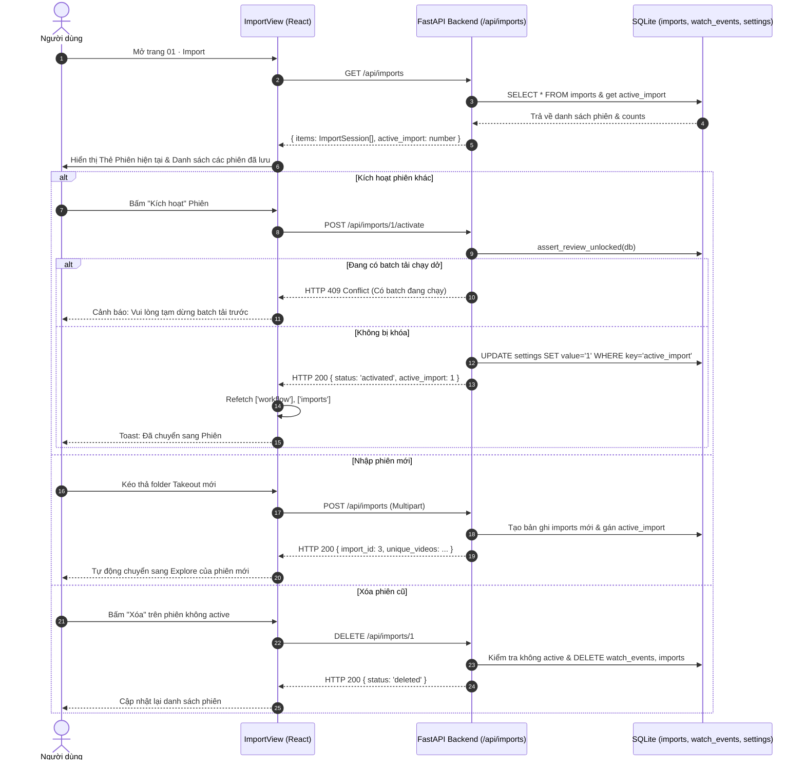

# Technical Design — Takeout Session Management

Ngày tạo: **2026-09-26**. Tính năng: `takeout-session-management`. Nhánh: `feature-takeout-session-management`.

---

## 1. Architecture & Interaction Flow



---

## 2. Data Models & API Contracts

### 2.1 TypeScript Interfaces (`frontend/src/api/types.ts`)

```typescript
export interface ImportSessionStatistics {
  source_rows: number;
  video_events: number;
  unique_videos: number;
  ads?: number;
  invalid_rows?: number;
  non_video_rows?: number;
  invalid_times?: number;
  missing_titles?: number;
  missing_channels?: number;
  library_matches?: number;
}

export interface ImportSession {
  id: number;
  source_name: string;
  source_hash: string;
  created_at: string;
  is_active: boolean;
  statistics: ImportSessionStatistics;
  counts: {
    music: number;
    rest: number;
  };
}

export interface ImportSessionsResponse {
  items: ImportSession[];
  active_import: number | null;
  batch_locked: boolean;
}
```

### 2.2 REST Endpoints (`src/auralytica/web.py`)

- `GET /api/imports`:
  - **Mô tả:** Lấy danh sách toàn bộ các phiên import trong CSDL.
  - **Xử lý:** Truy vấn `SELECT * FROM imports ORDER BY id DESC`, giải mã `statistics_json`, đếm số lượng video `music` và `rest` tương ứng trong phiên đó, so khớp với `active_import`.
  - **Response (200):** `ImportSessionsResponse`.
- `POST /api/imports/{import_id}/activate`:
  - **Mô tả:** Kích hoạt một phiên làm việc.
  - **Xử lý:**
    1. Kiểm tra phiên có tồn tại không (404 nếu không tìm thấy).
    2. Gọi `assert_review_unlocked(db)`: Nếu phiên hiện tại đang có batch tải ở trạng thái `queued` hoặc `running`, trả về 409 Conflict.
    3. Cập nhật `set_setting(db, 'active_import', str(import_id))`.
  - **Response (200):** `{"status": "activated", "active_import": import_id}`.
- `DELETE /api/imports/{import_id}`:
  - **Mô tả:** Xóa một phiên import cũ khỏi CSDL.
  - **Xử lý:**
    1. Kiểm tra: Không cho phép xóa phiên đang `Active` (400 Bad Request: *"Không thể xóa phiên đang hoạt động. Hãy chuyển sang phiên khác trước khi xóa."*).
    2. Kiểm tra `assert_review_unlocked(db)` (409 Conflict nếu có batch đang chạy).
    3. Xóa các bản ghi liên quan trong `watch_events WHERE import_id=?` và `imports WHERE id=?`.
  - **Response (200):** `{"status": "deleted", "deleted_id": import_id}`.

---

## 3. UI Component Design (`ImportView.tsx`)

Trang `01 Import` được chia làm 3 phân vùng trực quan:

1. **Header & Thanh trạng thái:**
   - Tiêu đề: `01 · Nhập & Quản lý phiên Takeout`.
   - Nút `+ Nạp phiên mới` (bấm để cuộn xuống hoặc mở khung dropzone nạp dữ liệu).
2. **Khu vực Phiên đang hoạt động (Active Session Card):**
   - Card lớn viền sáng xanh lá nhạt (`border-emerald-500/30 bg-emerald-950/10`):
     - Badge: `● Đang hoạt động`.
     - Tên file & Ngày giờ import.
     - Số liệu: `7.347 video` · `3.120 Nhạc` · `4.227 Còn lại`.
     - Nút hành động: `Tiếp tục xem dữ liệu →` (chuyển sang bước 02 Explore).
3. **Danh sách các phiên lưu trữ (Saved Sessions List):**
   - Danh sách các phiên còn lại được xếp theo thứ tự thời gian mới nhất:
     - Tên nguồn, ngày giờ nạp.
     - Số lượng video và thống kê.
     - Nút **"Kích hoạt phiên này"**: Có icon `CheckCircle`, click để chuyển `active_import`. Nếu `batch_locked`, nút bị disable kèm tooltip cảnh báo.
     - Nút **"Xóa"**: Nút thùng rác nhỏ màu xám/đỏ để xóa dọn dẹp các phiên thừa.
4. **Khu vực Nạp Takeout mới (New Import Dropzone):**
   - Khung kéo thả chuẩn mực của Auralytica, hỗ trợ kéo thả folder hoặc bấm chọn folder.
   - Khi nạp thành công, tự động làm mới danh sách và kích hoạt phiên mới ngay.

---

## 4. Bảo toàn tiến độ & Cơ chế an toàn (Safety & In-progress Preservation)

1. **Độc lập dữ liệu phiên:**
   - Bảng `watch_events` lưu `(import_id, source_row, video_id, watched_at)`.
   - Khi chuyển từ Phiên 2 sang Phiên 1, `active_import` đổi thành `1`. Các truy vấn tại Explore và Dedup tự động lấy các video thuộc `import_id = 1`.
   - Khi chuyển ngược lại từ Phiên 1 sang Phiên 2, toàn bộ dữ liệu của Phiên 2 vẫn vẹn nguyên 100%.
2. **Bảo vệ đợt tải (`batch_locked`):**
   - Khi bất kỳ batch nào ở trạng thái `queued` hoặc `running`, middleware và API kích hoạt phiên đều chặn lại với thông báo rõ ràng để không bao giờ làm gián đoạn worker tải audio.
