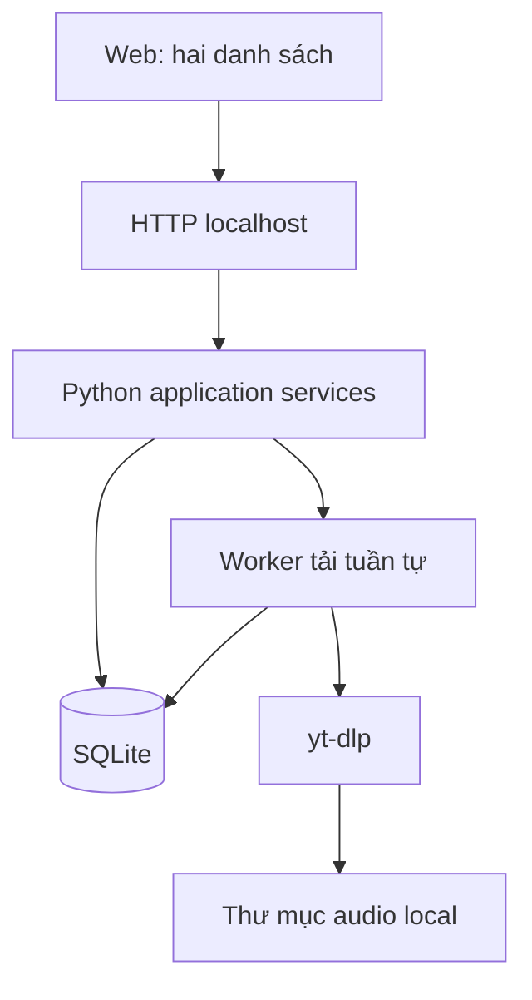

# Auralytica — Thiết kế MVP

Cập nhật: **2026-09-10**. Chốt bốn phần: luồng sử dụng, dữ liệu dùng chung, thành phần và xử lý lỗi/khôi phục. Thiết kế đã triển khai T01–T10 và [kiểm chứng chức năng T11](../testing/ACCEPTANCE.md); [T12 quickstart](../testing/QUICKSTART.md) đã đạt.

> Tài liệu này mô tả MVP cũ và được giữ làm lịch sử. Thiết kế hiện hành là [web workflow](2026-09-20-feature-web-workflow.md); các subcommand nghiệp vụ nhắc bên dưới đã bị gỡ ở WFT08.

Nguồn: [Requirements](../requirements/README.md) · [Dashboard dự án](../../../PROJECT_DASHBOARD.md).

## Architecture Overview

### 1. Luồng sử dụng và giao diện

1. Chạy `auralytica` để mở web local; kéo thả hoặc chọn folder Takeout.
2. Đọc lịch sử JSON, gom theo video ID và phân vào hai danh sách. Bằng chứng nhạc mạnh đưa sang trái; ca chưa rõ hoặc bị loại nằm bên phải với lý do.
3. Chuyển từng video hoặc các dòng đã tick qua lại để sửa kết quả. Lưu quyết định ngay khi backend xác nhận.
4. Chọn đường dẫn thư mục tải trên máy, bấm **Tải toàn bộ**. Backend chụp danh sách mọi video bên nhạc thành một batch cố định.
5. Xem tiến độ chung và kết quả từng video; có thể dừng, tiếp tục hoặc thử lại phần lỗi.

```text
Folder Takeout [Kéo thả / Chọn folder]   Thư mục tải [đường dẫn trên máy]

ĐÃ NHẬN DẠNG LÀ NHẠC (N)               CÒN LẠI (M)
[Tìm kiếm / Lọc]                        [Tìm kiếm / Lọc lý do]
[✓] Ảnh · Tiêu đề · Kênh · Lượt xem      [✓] Ảnh · Tiêu đề · Kênh · Lượt xem
Link · Lý do · Trạng thái tải           Link · Lý do · Trạng thái tải
Tự động / Đã chuyển tay                  Chưa rõ / Shorts / Podcast / Khác
[Chuyển sang Còn lại →]                 [← Chuyển sang Nhạc]
[Chuyển các dòng đã chọn →]             [← Chuyển các dòng đã chọn]

[Tải toàn bộ: K file cần tải / N video nhạc]
Tiến độ batch · Thành công · Đã có file · Lỗi · Còn chờ
```

- Hai danh sách cạnh nhau trên desktop. Video thêm thủ công vẫn ở bên nhạc, có ghi nguồn quyết định; không tạo danh sách thứ ba.
- Checkbox chỉ để chuyển hàng loạt. “Chọn trang này” chỉ chọn trang hiện tại; đổi trang/bộ lọc xóa tick tạm thời. Hiển thị cả tổng mỗi bên và số khớp bộ lọc.
- **Tải toàn bộ không phụ thuộc checkbox, trang hoặc bộ lọc**. Bỏ qua file hoàn tất còn hợp lệ tại thư mục đích; vô hiệu hóa nút nếu không còn file cần tải. Không phải duyệt hết bên còn lại trước.
- Một lượt là một hàng đợi chung, một worker tải tuần tự. Khi batch đang chạy, khóa import, chuyển video, đổi thư mục tải và tạo batch mới; vẫn xem/lọc và dừng được. Muốn sửa danh sách thì dừng batch trước, sửa rồi tạo batch mới. Tiếp tục batch cũ vẫn dùng snapshot cũ.
- Chuyển video về “Còn lại” không xóa file đã tải. Mở lại ứng dụng giữ nguyên quyết định đã lưu.



## Data Models

### 2. Dữ liệu dùng chung

| Entity | Dữ liệu và ràng buộc chính |
| --- | --- |
| Import | ID, hash nội dung nguồn, thời điểm, thống kê bản ghi hợp lệ/lỗi; nhập lại cùng nguồn không nhân đôi sự kiện. |
| WatchEvent | Import ID + chỉ số dòng nguồn là duy nhất; video ID nếu có, timestamp UTC; giữ các lần xem riêng biệt. |
| Video | Video ID duy nhất, tiêu đề, channel ID/URL, thumbnail, metadata và nguồn; nhóm tự động, lý do, nhóm người dùng sửa nếu có. |
| ChannelDecision | Channel ID/URL, nhãn và nguồn xác nhận của người dùng local; sửa cấp video ưu tiên hơn. |
| DownloadBatch | ID, thư mục đích đã resolve, thời gian, trạng thái và snapshot video ID cố định. |
| DownloadItem | Duy nhất theo batch + video ID; queued/running/completed/skipped/failed/cancelled, số lần thử, tiến độ, đường dẫn, kích thước và lỗi. |
| Settings | Import đang xem, thư mục tải gần nhất, phiên bản schema; thư mục dữ liệu ứng dụng có thể cấu hình. |

Nhóm hiệu lực là `user_group` nếu có, nếu không dùng `auto_group`; chỉ có `music` và `rest`. Không có cờ chọn tải độc lập. Tick trên bảng là trạng thái tạm của giao diện. Chạy lại quy tắc không ghi đè sửa tay.

Import mới thay lịch sử đang xem, giữ quyết định và kết quả tải theo video ID. Số lượt xem tính trên import đang xem; MVP chưa cộng gộp nhiều export chồng lặp. Chỉ công bố import mới sau khi parse và lưu thành công.

Chuyển hàng loạt và tạo snapshot dùng transaction. Web dùng SQLite và khóa worker liên tiến trình; chỉ một tiến trình sở hữu worker tại một thời điểm. File audio nằm ngoài database.

## API Design

Các giao diện dưới đây là hợp đồng dự kiến cho implementation. HTTP API phục vụ giao diện trên máy; không yêu cầu API phân loại bên ngoài.

| Thao tác | Web / HTTP local nội bộ |
| --- | --- |
| Mở web | `auralytica` hoặc desktop entry |
| Import | Trang Import / `POST /api/imports`: file JSON lịch sử và library tùy chọn; trả thống kê nhập. |
| Xem danh sách | Trang Explore / `GET /api/videos`: group, search, channel, reason, sort, page, page_size. |
| Chuyển nhóm | Nút từng dòng/chọn trang / `POST /api/videos/move`. |
| Tải toàn bộ | Trang Download / `POST /api/downloads`: output_dir + preview token. |
| Tiến độ | Bảng lượt tải / `GET /api/downloads/{id}`. |
| Dừng/tiếp tục | Nút trên batch / `POST /api/downloads/{id}/stop`, `/resume`. |

Worker chạy ngoài request HTTP; web polling khi batch hoạt động. Nhấp tải lặp trả batch đang chạy, không tạo việc trùng; mutation bị khóa trả lỗi 409 và lý do rõ.

Browser không cung cấp đường dẫn tuyệt đối của folder đã kéo thả: frontend chọn các file cần thiết trong cây folder và gửi về localhost. Nếu có nhiều lịch sử, cho chọn nguồn; không upload cả Takeout. Không dùng relative path từ browser làm đường dẫn ghi file.

Thư mục tải là ô nhập đường dẫn trên máy chạy backend, mặc định `~/Music/Auralytica`, nhớ lần dùng gần nhất và kiểm tra quyền ghi. Không giả định folder picker của browser cho phép backend ghi vào một đường dẫn tuyệt đối.

## Component Breakdown

### 3. Thành phần triển khai

| Thành phần | Trách nhiệm |
| --- | --- |
| Importer | Tìm/parse JSON, chuẩn hóa ID, lưu sự kiện và video, thống kê lỗi; đối chiếu library chỉ với ID trong lịch sử. |
| Suggestions | Topic/library là bằng chứng mạnh sau kiểm tra loại trừ; tiêu đề/kênh/lặp lại chỉ hỗ trợ. Lưu lý do và nguồn, không biến thiếu từ khóa thành non-music. |
| Review service | Tính nhóm hiệu lực, tìm/lọc/phân trang, chuyển nhóm có transaction và bảo toàn sửa tay. |
| Web | Giao diện duy nhất; có ảnh/link, nút chuyển và một nút tải toàn bộ. |
| Downloader | Snapshot, yt-dlp audio nguồn, tiến độ, dừng/tiếp tục và lỗi từng video. |
| Storage | SQLite, migrations, lưu review/batch, kiểm tra file và khóa worker. |

## Design Decisions

| Quyết định MVP | Lý do / giới hạn |
| --- | --- |
| Python hiện có + FastAPI, HTML/CSS/JavaScript thuần cùng origin | Dùng chung core CLI/web, đủ cho hai bảng và polling; chưa cần frontend framework hoặc dịch vụ hàng đợi riêng. |
| SQLite chuẩn Python | Trạng thái local có transaction, không cần database server; phải kiểm tra runtime có sqlite3 trước khi triển khai. |
| Một worker tải tuần tự | Dễ kiểm soát dừng, resume, tiến độ và tránh trùng; đo thực tế trước khi tăng song song. |
| JSON Unicode, Linux desktop trước | Bám dữ liệu hiện tại; HTML, merge nhiều export và đóng gói nền tảng khác để sau. |
| Quy tắc + sửa tay | Không bắt buộc model audio, API trả phí hoặc matching Spotify; độ chính xác chưa được đo. |

## Non-Functional Requirements

### 4. Xử lý lỗi và khôi phục

| Tình huống | Hành vi |
| --- | --- |
| Thiếu lịch sử, JSON hỏng hoặc chỉ có HTML | Báo nguồn lỗi/hướng dẫn định dạng, giữ import đang dùng; không công bố dữ liệu nhập dở. |
| Thumbnail/metadata thiếu | Placeholder, vẫn xem và sửa được. Hashtag hoặc duration đơn lẻ không xác nhận Shorts; ca nghi ngờ ở “Còn lại” có lý do. |
| Video private/xóa/không tải được | Ghi failed/unavailable cho file, tiếp tục video khác; batch có lỗi không được báo tất cả thành công. |
| Mất mạng/ứng dụng thoát | Giữ file partial và kết quả hoàn tất. Sau restart, xác nhận worker cũ đã mất khóa rồi chuyển mục running về queued; người dùng tiếp tục batch khi sẵn sàng. |
| Bấm dừng | Dừng tiến trình tải có kiểm soát, giữ partial; các mục chưa hoàn tất có thể tiếp tục từ snapshot. |
| Thư mục không ghi được/hết dung lượng | Kiểm tra trước tải; nếu lỗi xuất hiện giữa batch thì dừng và báo lỗi, giữ kết quả cũ. |
| File hoàn tất thiếu hoặc thay đổi kích thước | Không bỏ qua chỉ vì database nói completed; kiểm tra đường dẫn và kích thước tại thư mục đích, tải lại nếu không còn hợp lệ. |
| Tên file trùng | Tên được làm sạch kèm `[videoID]`; thêm hậu tố nếu đụng file không liên quan, không ghi đè. Chỉ ghi completed sau yt-dlp thành công và có file cuối. |

Tải audio stream tốt nhất truy cập được, giữ codec; chỉ remux bằng stream copy nếu cần. Nếu không có stream phù hợp thì báo lỗi, không tự chuyển mã. “Gốc” không có nghĩa là file master của người đăng.

Web bind loopback, kiểm tra Host/Origin cho request thay đổi dữ liệu, không mở CORS rộng. Escape tiêu đề/kênh, giới hạn upload/phân trang và kiểm tra ID/đường dẫn. Gọi downloader bằng argument list, không ghép shell command từ dữ liệu người dùng.

Phân trang mặc định 50 dòng, lazy-load ảnh. Kiểm chứng với khoảng 6.400 video khi triển khai; chưa cam kết thời gian xử lý hoặc tải khi chưa đo.

### Đối chiếu requirements và nghiệm thu

| Phạm vi | Thiết kế | Kiểm chứng khi triển khai |
| --- | --- | --- |
| R01–R03, R11 | Core chung, import, sự kiện/video riêng, SQLite | AC01–AC02, AC07: import thực, lặp import, CLI/web thống nhất. |
| R04–R06 | Suggestions, bằng chứng loại trừ, override | AC03: ca chắc/chưa rõ/loại đều sửa được, chạy lại không mất sửa tay. |
| R07–R08 | Hai bảng, chuyển từng/hàng loạt, snapshot | AC04–AC05: reload, lọc/phân trang, tải cả mục ẩn và nhấp tải lặp. |
| R09–R11 | Audio nguồn, trạng thái từng file, resume | AC05–AC06: file phát được, một video lỗi, dừng/resume, file hoàn tất bị mất. |
| R12 | Xử lý local, không phụ thuộc dịch vụ phân loại | AC08: luồng chính không đòi API key, Spotify hoặc model. |

[Kế hoạch triển khai](../planning/README.md) đã chia thành T01–T12. T01–T03 đã có runtime, SQLite v1 và CLI import JSON; tiếp theo phân loại → hai danh sách → tải batch. Không mở rộng notebook hay catalog matching để chặn luồng này.

Tiến độ 2026-09-10: T04 đã có rules-v1 và classify CLI; T05 tiếp theo. Thiết kế hai bảng giữ nguyên. Talk-context từ tiêu đề là ca cần duyệt; URL Shorts và nhãn kênh người dùng là bằng chứng loại trừ rõ hơn. Không lấy mẫu blacklist cá nhân làm mặc định.

Tiến độ T05 (2026-09-10): review service và CLI list/move đã có, phân trang mặc định 50 và chuyển hàng loạt tối đa 1.000 ID. T06 nối HTTP local, T07 dựng hai bảng; hợp đồng UX giữ nguyên.

Tiến độ T06 (2026-09-10): API local đã triển khai. POST yêu cầu Origin trùng Host/port, tổng body tối đa 64 MiB. Import nhận multipart files: một lịch sử JSON và library CSV tùy chọn; frontend chọn nguồn trước gửi nếu nhiều lịch sử. T07 tiếp tục UI hai bảng và rendering văn bản an toàn; chưa có downloader.

Tiến độ T07 (2026-09-10): hai bảng đã triển khai; desktop cạnh nhau, màn hình hẹp xếp dọc. T08 tiếp theo. Nút Tải toàn bộ hiện disabled, ghi Sắp có cho đến T10. serve cung cấp URL để mở thủ công, chưa tự mở browser trong môi trường headless.

Tiến độ T08 (2026-09-10): core batch và flock trên Linux đã có. Khóa review áp dụng từ queued đến running, đóng khoảng trống giữa tạo batch và nhận việc. Batch all-skipped completed ngay. Dừng queued/recover orphan có ở core, dừng worker đang tải và giao diện batch thuộc T09–T10. Nút tải vẫn disabled cho đến khi nối downloader.


Tiến độ T09 (2026-09-10): worker audio chạy yt-dlp trong subprocess có thể dừng, kế thừa flock để giữ khóa nếu cha chết. File staging nằm cùng filesystem với đích; publish bằng hardlink không overwrite, lưu planned path để khôi phục sau crash. Giữ codec bestaudio nguồn, kiểm tra video ID/audio-only trước completed. Stop flag lưu trong settings, không thêm schema. T10 nối điều khiển CLI/web; hiện nút tải vẫn disabled.


Tiến độ T10 (2026-09-10): CLI/web đã nối downloader. Worker detached sống độc lập tab/server; stop gửi flag hoặc recover khi flock đã tự do. UI nhập đường dẫn thư mục local, preview chỉ đọc, polling mỗi giây và trạng thái/lỗi phân trang; khóa mutation khi active, vẫn duyệt được. 50 batch gần đây ưu tiên active hiển thị trong selector; CLI theo ID cho lượt cũ hơn. Lỗi launch/preflight lưu settings theo batch, không đổi schema. T11 tiếp theo nghiệm thu toàn luồng.
